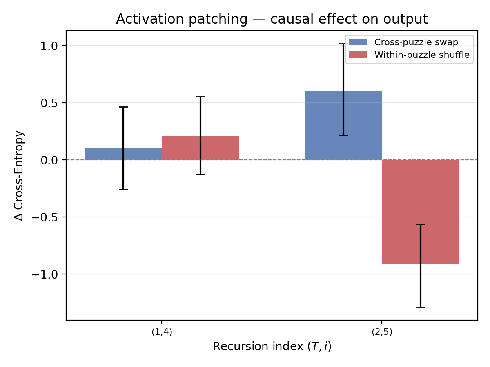
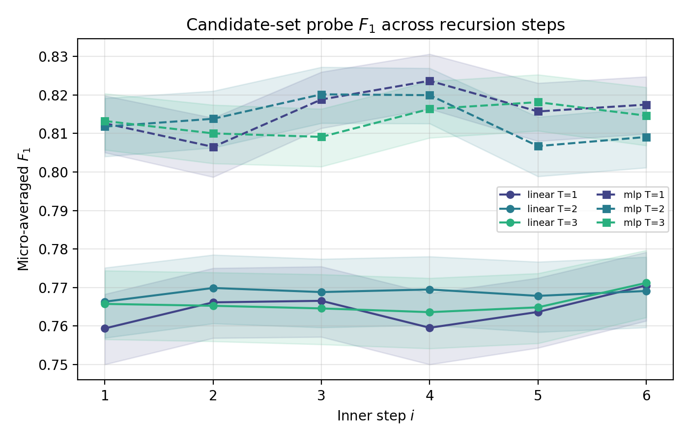
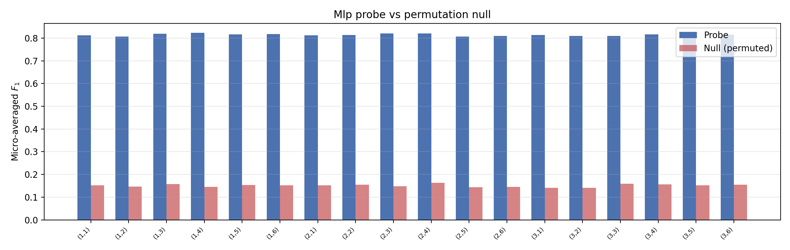
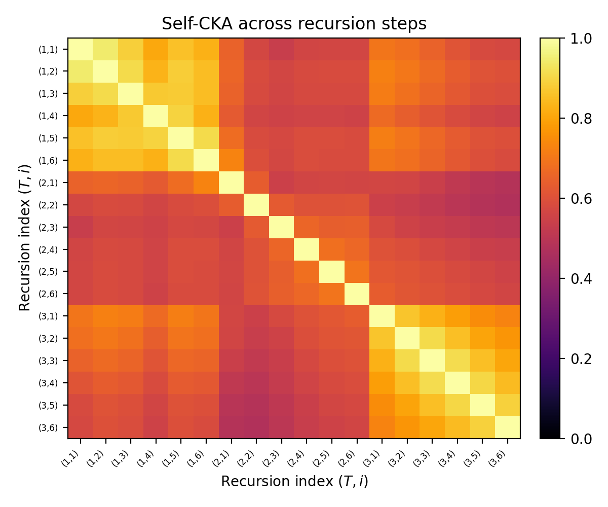
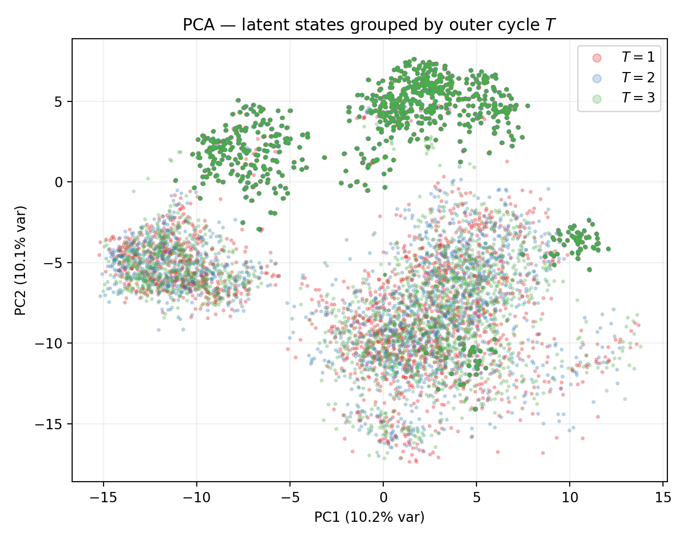
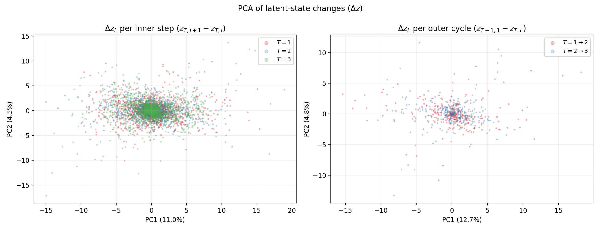
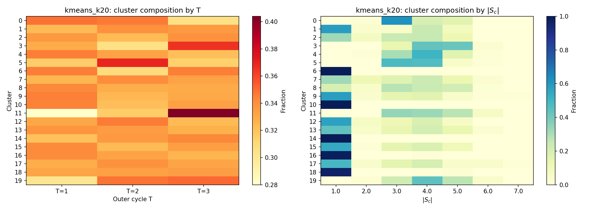
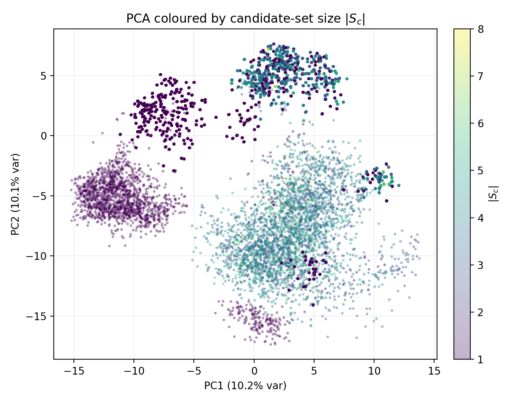
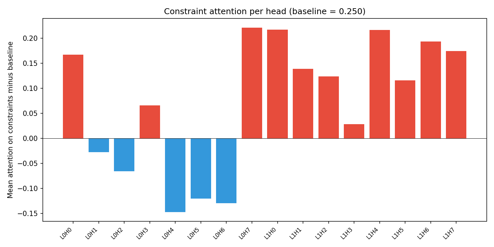
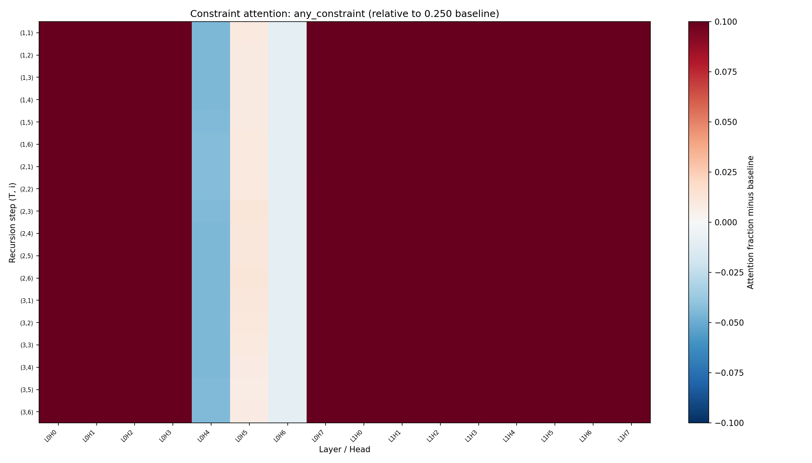

# What Does the Latent State Learn?
### Interpreting Recursive Constraint Solving in a Weight-Shared Transformer

This repository contains the full code, experiments, and results behind a mechanistic-interpretability study of the **Tiny Recursive Model (TRM)** — a 7M-parameter, weight-shared recursive transformer that solves Sudoku-Extreme. The write-up is currently under review at NeurIPS 2026; every figure below is reproduced from the submission and is reproducible from this repo.

**The one-sentence result:** TRM's recursion is a *multi-phase geometric reorganization of static, constraint-routed content* — not progressive constraint propagation. The model establishes everything it knows about candidate sets at the very first recursion step, routes information along the Sudoku constraint graph with attention heads that never change, and spends its 18 recursion steps restructuring the *geometry* of the latent state until it converges toward the configuration of solved cells.

## Setup

TRM ([Jolicoeur-Martineau, 2025](https://arxiv.org/abs/2510.04871)) applies a single 2-layer attention block recursively — 3 outer cycles × 6 inner steps = 18 latent states `z_L(T, i)` — and reaches 87.4% complete-solution accuracy on Sudoku-Extreme where GPT-4o and Gemini-1.5 Pro score 0%. Nobody had asked what its latent state actually encodes. We probe a frozen, converged checkpoint (**73.2% complete-puzzle / 89.5% per-cell test accuracy** on `sudoku-extreme-1k-aug-1000`, trained with AdamW) using six triangulated methods: supervised probing, CKA, activation patching, PCA/PaCMAP/TriMAP visualization, full-space clustering, and per-head attention analysis.

## Finding 1 — Probing and patching *dissociate*, sharply

Probes say the most informative recursion step is `(T=1, i=4)`. Patching says that step is causally irrelevant — and that the *least* decodable step, `(T=2, i=5)`, is where the model lives or dies.

| Patched step | Intervention | ΔCE (mean) | 95% CI | Effect |
|---|---|---|---|---|
| `(T=1, i=4)` — **highest** probe F1 | Cross-puzzle swap | +0.11 | [−0.26, +0.47] | none |
| `(T=1, i=4)` | Within-puzzle shuffle | +0.21 | [−0.13, +0.56] | none |
| `(T=2, i=5)` — **lowest** probe F1 | Cross-puzzle swap | **+0.60** | [+0.21, +1.02] | **hurts** |
| `(T=2, i=5)` | Within-puzzle shuffle | **−0.91** | [−1.29, −0.57] | **helps(!)** |

Early corruption gets repaired by the remaining recursion; late corruption cannot be. And the sign flip at depth — shuffling cell positions *helps* while swapping content hurts — means the model depends on aggregate content, not strict per-cell positional binding. Representational richness (probes) and causal importance (patching) are simply not the same thing in this model, and here the inversion is unusually sharp.



## Finding 2 — The recursion restructures geometry without adding information

Linear probes decode candidate-set membership at **F1 ≈ 0.76–0.77**, MLP probes at **F1 ≈ 0.81–0.82** — *flat across all 18 recursion steps*, ~5× above a stratified permutation null (≈ 0.15). No step-wise trend survives Benjamini–Hochberg correction. The candidate-set encoding is established at `(T=1, i=1)` and never improves.

| | |
|---|---|
|  |  |

But the *geometry* is anything but static. CKA between the 18 steps shows three block-diagonal phases: within-cycle similarity ≈ 0.7–0.9, dropping to ≈ 0.2–0.4 between cycles 1 and 3. PCA, PaCMAP, and TriMAP all place `T=3` in its own region, and the inner-step deltas `z(T,i+1) − z(T,i)` shrink visibly by the third cycle.

| | |
|---|---|
|  |  |



## Finding 3 — The latent organizes by *difficulty*, not by recursion step

Clustering in 50-dimensional PCA space (89.6% of variance) shows the dominant axis of organization is **candidate-set size |Sc|** — how constrained a cell is — not the recursion index:

| Method | k | Noise | Purity T (chance 0.33) | Purity \|Sc\| (chance 0.11) | Purity box (chance 0.11) |
|---|---|---|---|---|---|
| K-Means | 3 | 0% | 0.34 | **0.48** | 0.38 |
| K-Means | 9 | 0% | 0.34 | **0.52** | 0.40 |
| K-Means | 20 | 0% | 0.35 | **0.59** | 0.40 |
| HDBSCAN | 2 | 13% | 0.39 | **0.69** | 0.35 |

Purity with respect to the outer cycle T sits at chance; purity with respect to |Sc| is 5–6× above chance. And the region `T=3` converges into is the same region occupied by `|Sc|=1` cells — cells whose answer is already determined. The late recursion converges toward the geometry of solved cells.

| | |
|---|---|
|  |  |

## Finding 4 — Constraint-routing "induction-style" heads that never move

Several heads (L0H7, L1H0, L1H4, L1H6, L1H7) place **50–94% of their attention mass on row/column/box neighbours** of the query cell — 4× above the uniform baseline of 0.25 — with different heads specializing on different constraint types. And the per-head pattern is essentially *identical* at every one of the 18 recursion steps (L1H0 holds 0.93–0.94 at every `(T, i)`).

This bounds where the multi-phase restructuring can come from: **not** attention re-routing, because the routing never changes. It must originate in the value projections or the SwiGLU MLP — attention as static routing, MLP as content computation.

| | |
|---|---|
|  |  |

## The ablation, resolved: RoPE is the load-bearing component

An earlier version of this repo asked which architectural component drives spatial reasoning in TRM — RoPE or the CastedLinear layers — and left the answer as a to-do. It's answered:

| Configuration | Positional encoding | Complete-puzzle accuracy |
|---|---|---|
| Baseline TRM (this checkpoint) | RoPE | **73.2%** (89.5% per-cell) |
| No-RoPE ablation (full training recipe) | Learned absolute | **0%** |

**Removing RoPE collapses accuracy to zero.** Relative position information injected directly into the Q/K dot products is a precondition for everything above — without it there is no spatial reasoning to interpret. The ablation configs live in `experiments/ablation/configs/` (including `paper_no_rope.yml`) if you want to rerun this.

## Repository structure

```
TinyLLM/
├── trm_base/                    # Tiny Recursive Model (TRM / ACT v1)
│   ├── trm.py                   #   TinyRecursiveReasoningModel_ACTV1
│   ├── layers.py                #   CastedLinear, RoPE, Attention, SwiGLU
│   ├── losses.py                #   ACTLossHead, stablemax cross-entropy
│   ├── pretrain.py              #   Training loop (single-GPU / DDP)
│   ├── build_sdku_data.py       #   Builds on-disk Sudoku data from HuggingFace
│   └── config_pretrain_paper.yml#   Paper-scale training config
│
├── experiments/
│   ├── probing/                 # ** The interpretability pipeline **
│   │   ├── extract_activations.py   # Hook z_L / z_H at all 18 (T, i) steps
│   │   ├── candidate_sets.py        # Ground-truth S_c via constraint propagation
│   │   ├── train_probes.py          # Linear + MLP probes with permutation null
│   │   ├── cka.py                   # Self-CKA across recursion steps
│   │   ├── activation_patching.py   # Cross-swap & within-shuffle interventions
│   │   ├── cluster_latents.py       # 50D K-Means / HDBSCAN + purity
│   │   ├── visualize_trimap_pacmap.py / visualize_latents*.py
│   │   ├── induction_heads.py       # Per-head constraint-attention analysis
│   │   └── plot_results.py          # All paper figures
│   └── ablation/                # RoPE / CastedLinear ablation (resolved above)
│
├── core/, sudoku/, scripts/     # GPT-2-style demo transformer + Sudoku task
├── scripts/unity/               # Slurm scripts: train_trm_paper.sh,
│                                #   run_probing.sh, run_latent_analysis.sh, …
├── assets/                      # Paper figures (shown in this README)
└── results/, checkpoints/, data/  # Generated artifacts (gitignored)
```

## Reproducing

```bash
pip install -r requirements.txt

# 1. Build the Sudoku-Extreme dataset
python trm_base/build_sdku_data.py

# 2. Train the TRM checkpoint (~18h on one L40S)
python trm_base/pretrain.py            # or: sbatch scripts/unity/train_trm_paper.sh

# 3. Run the probing pipeline (activations → candidate sets → probes → CKA → plots)
sbatch scripts/unity/run_probing.sh

# 4. Clustering, PaCMAP/TriMAP, induction heads
sbatch scripts/unity/run_latent_analysis.sh

# 5. Activation patching
python -m experiments.probing.activation_patching --help
```

All analysis seeds, sample sizes, and hyperparameters are fixed and documented in the paper's reproducibility appendix; the interpretability experiments run in under 8 hours on a single L40S.

## Paper

*What Does the Latent State Learn? Interpreting Recursive Constraint Solving in a Weight-Shared Transformer* — under review, NeurIPS 2026. The figures in this README are from the submission.

## License

MIT
